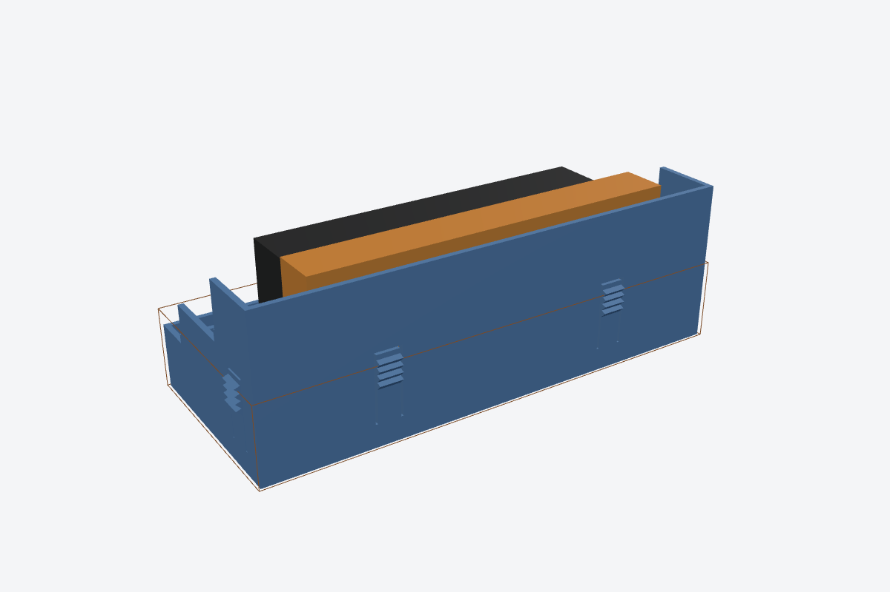
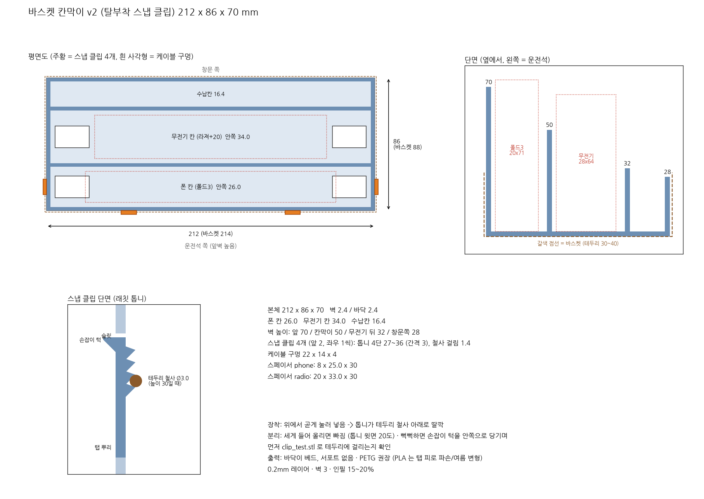
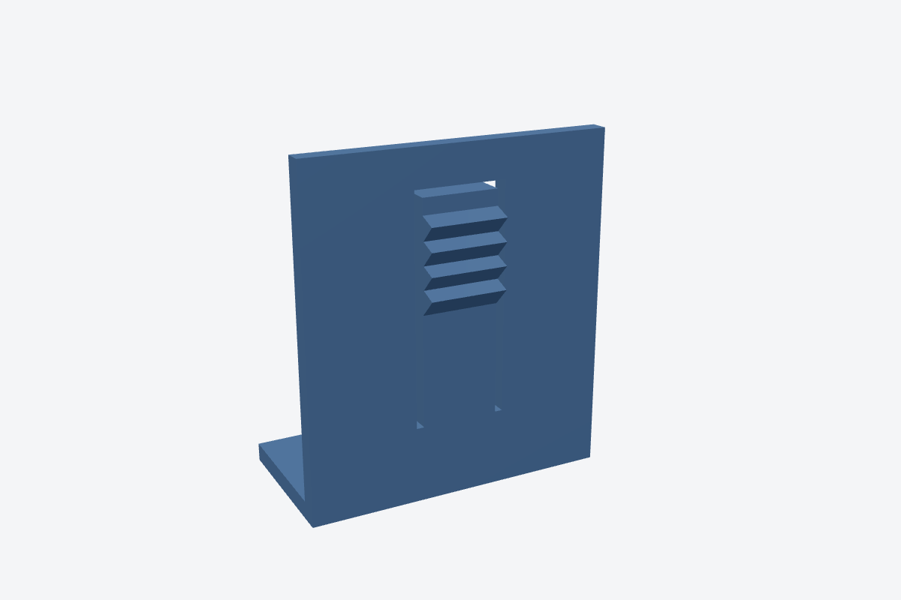

# 철망 바스켓 칸막이 v2 (탈부착 스냅 클립)

버스 창문 레일에 거는 철망 바스켓(내경 214 x 88, 깊이 30~40) 안에 끼우는 칸막이입니다.
흔들릴 때 기기가 운전석 쪽으로 떨어지지 않도록 **운전석 쪽 벽을 70mm로 가장 높게** 했습니다.
접착제나 나사 없이 **필라멘트 스냅 클립 4개**(앞 2, 좌우 1씩)로 바스켓 테두리 철사에 걸어서 고정합니다.




| 칸 (운전석 -> 창문) | 안쪽 폭 | 벽 높이 | 넣는 것 |
|---|---|---|---|
| 폰 칸 | 26.0 | 앞벽 70 | 폴드3 접은 상태 (공식 158.2x67.1x16, 케이스 포함 약 162x71x20) |
| 무전기 칸 | 34.0 | 칸막이 50 | 라져+20 (공식 59x145x23, 케이스 포함 약 64x150x28) |
| 수납칸 | 16.4 | 무전기 뒤 32 / 창문쪽 28 | 펜 등 (남는 깊이) |

## 스냅 클립 원리



- 벽에 U자 슬릿을 내서 휘어지는 탭을 만들고, 탭 바깥면에 톱니를 달았습니다
- 위에서 눌러 넣으면 탭이 안쪽으로 휘었다가, 톱니가 테두리 철사(Ø3) 아래로 들어가며 **딸깍** 걸립니다
- 톱니는 3mm 간격 4단(27/30/33/36mm)입니다. 테두리 높이가 30~40 사이 어디든 가장 가까운 톱니가 걸리고, 남는 유격은 최대 3mm입니다
- 톱니 윗면은 20도로 기울어 있어서 차가 흔들려도 빠지지 않고, **손으로 세게 들어 올리면 탭이 휘면서 빠집니다**
- 뻑뻑하면 탭 윗끝 안쪽의 손잡이 턱(3mm)을 칸 안쪽으로 당기면서 들어 올리세요
- 전혀 안 빠지게 하려면 `release_deg`를 0으로, 더 쉽게 빠지게 하려면 30으로 바꿉니다
- 톱니 아랫면은 45도라서 바닥을 베드에 둔 방향 그대로 서포트 없이 출력됩니다

## 파일

| 파일 | 설명 |
|---|---|
| `out/clip_test.stl` | **먼저 출력하세요.** 클립 1개짜리 벽 조각(40 x 45)으로 테두리에 걸리는지 확인합니다 |
| `out/insert.stl` | 본체 (클립 톱니 포함 216.8 x 88.4 x 70) |
| `out/spacer_phone.stl`, `out/spacer_radio.stl` | 길이 방향 유격을 메우는 블록 |
| `out/drawing.png`, `out/drawing.pdf` | 도면 |
| `out/render_*.png` | 3D 렌더링 |

## 조정

```bash
pip install manifold3d trimesh matplotlib numpy
python3 make_insert.py --rim-min 32 --rim-max 38   # 테두리 높이를 재면 톱니 범위를 좁힘
python3 make_insert.py --wire-d 3.2                # 테두리 철사 지름
python3 make_insert.py --phone-slot 24 --radio-slot 36
```

- 클립이 헐거우면: `params.json`의 `tooth_out`을 2.4에서 2.8로 올립니다
- 클립이 너무 빡빡하면: `tooth_out`을 2.0으로 내립니다
- 반영: `--params params.json`

## 출력 권장

- PETG를 권장합니다. PLA는 탭을 반복해서 휘면 부러지기 쉽고, 여름 차 안에서 변형될 수 있습니다
- 0.2mm 레이어 · 벽 3 · 인필 15~20% · 서포트 없음
- 본체 약 145cm³이고, 필라멘트는 대략 70~90g 정도 듭니다

이전 버전(v1: 앞 무전기/뒤 폰, 클립 없음)은 커밋 `b594937`에 남아 있습니다.
