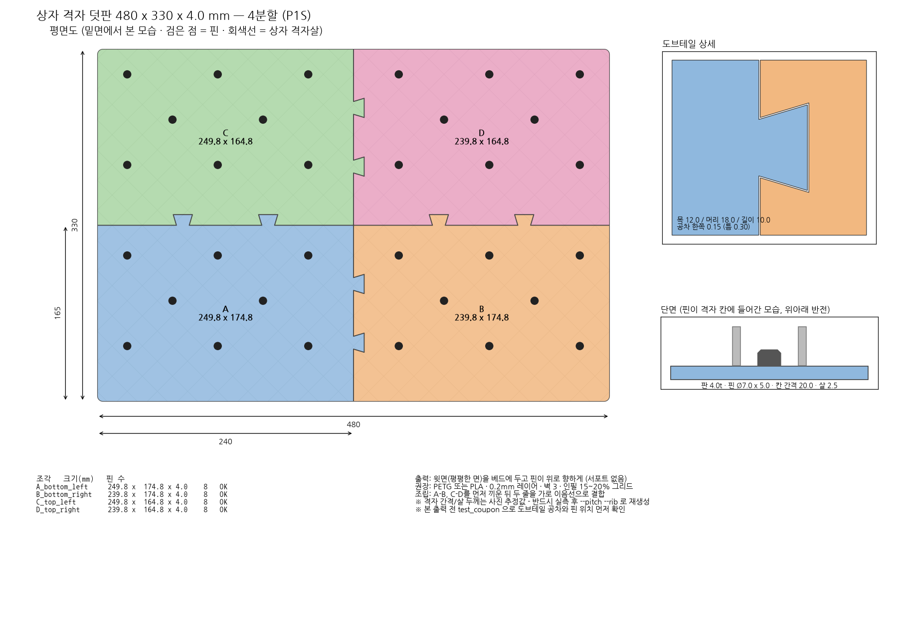

# 상자 격자 덧판 (480 x 330 x 4 mm, 4분할)

뒤집은 플라스틱 상자의 45도 다이아몬드 격자 위에 올리는 평판입니다.
P1S 베드(256 x 256)에 맞도록 4조각으로 나눴고, 조각끼리는 퍼즐형 도브테일로 끼워 맞춥니다.
밑면의 핀이 격자 칸에 들어가 판이 미끄러지지 않습니다.



## 파일

| 파일 | 설명 |
|---|---|
| `out/plate_A_bottom_left.stl` ~ `plate_D_top_right.stl` | 출력용 4조각 (핀 위, 윗면이 베드) |
| `out/test_coupon_L.stl`, `test_coupon_R.stl` | 본 출력 전 공차/핀 확인용 작은 쿠폰 (약 34g) |
| `out/preview_assembled.stl` | 조립 상태 미리보기 (출력용 아님) |
| `out/drawing.png`, `drawing.pdf` | 치수 도면 |
| `out/params_used.json` | 생성에 쓰인 파라미터 |
| `make_plate.py` | 파라미터 기반 생성기 |

## 순서

1. **격자 실측** (아래 표) -> 값이 기본값과 다르면 재생성
2. `test_coupon_L/R` 출력 -> 도브테일 끼움 정도와 핀이 칸에 들어가는지 확인
3. 4조각 출력 (조각당 약 160 cm³, 인필 15~20%면 대략 90~120 g)
4. A-B, C-D 를 먼저 끼우고 두 줄을 가로 이음선으로 결합. 헐거우면 순간접착제

## 실측이 필요한 값 (현재는 사진 추정값)

| 항목 | 기본값 | 재는 법 | 옵션 |
|---|---|---|---|
| 격자 간격 | 20.0 | 평행한 살 **10칸**을 살에 직각으로 재서 10으로 나눔 | `--pitch` |
| 살 두께 | 2.5 | 살 윗면 폭 | `--rib` |
| 살 깊이 | - | 핀 높이(5mm)보다 깊은지만 확인 | `--pin-h` |

```bash
pip install shapely manifold3d trimesh matplotlib numpy
python3 make_plate.py --pitch 21.3 --rib 2.8
# 도브테일이 빡빡하면 --clear 0.2, 헐거우면 --clear 0.1
```

## 출력 설정 (권장)

- 방향: STL 그대로 (윗면이 베드, 핀이 위) -> 서포트 불필요
- 재질: 야외용이면 PETG, 실내면 PLA
- 0.2mm 레이어 · 벽 3 · 상/하단 4층 · 인필 15~20% 그리드
- 판이 넓어 모서리 들뜸 주의: 베드 청소, 필요시 브림 3~5mm
